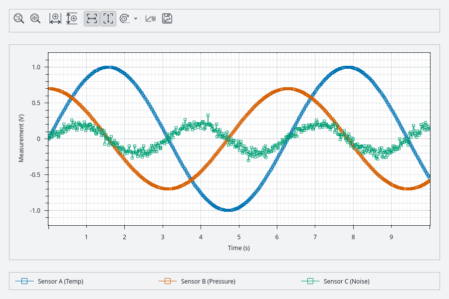
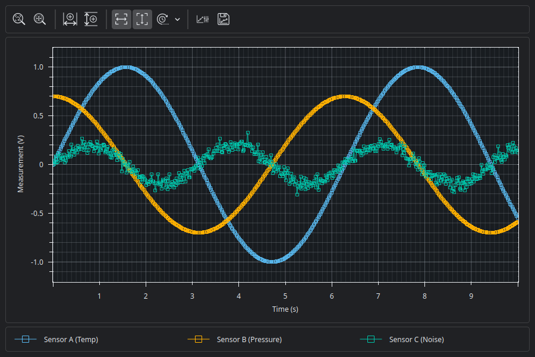
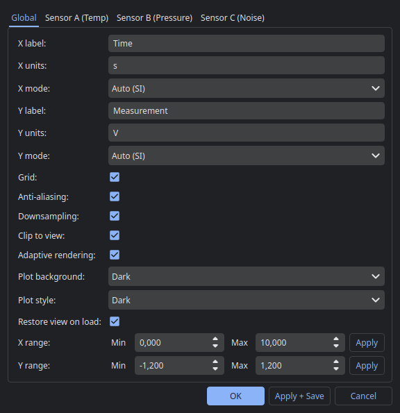
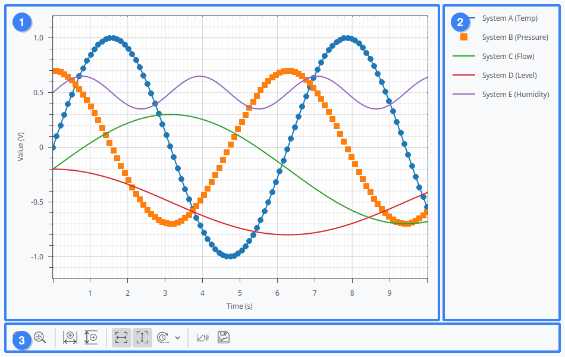

# PyQtLabGraph

[](https://pypi.org/project/pyqtlabgraph/)
[](https://pypi.org/project/pyqtlabgraph/)
[](https://opensource.org/licenses/MIT)

A powerful, interactive, and premium live plotting library for **PySide6/Qt6**, based on **PyQtGraph**.

`PyQtLabGraph` is built for both interactive scientific data analysis and high-performance real-time visualization, providing an embeddable plot widget, dedicated toolbars, external legend layouts, smart axis formatting, layout persistence, and modern, explicit visual themes.

### Previews

| Light Theme (Default) | Dark Theme |
| :---: | :---: |
|  |  |

| Modeless Customize Dialog | Modular Widget Layout |
| :---: | :---: |
|  |  <br> **[1]** Plot Widget &bull; **[2]** External Legend Widget &bull; **[3]** Plot Toolbar Widget |

---

## Why PyQtLabGraph? (Aesthetic & Usability Philosophy)

In scientific and engineering environments, two plotting libraries dominate the Python ecosystem:
- **Matplotlib**: Unrivaled for generating static, publication-quality figures, but often heavy or sluggish when handling interactive real-time telemetry or rapid live data streams.
- **PyQtGraph**: An exceptionally fast, graphics-hardware-accelerated library built for high-performance plotting, but one that deliberately leaves user-interface chrome (like toolbars, legends, customize dialogs, and layout persistence) to be implemented by the developer from scratch.

`PyQtLabGraph` bridges this gap. It is designed as a **high-productivity, instrument-grade plotting interface** that brings the ease of use of traditional graphical programming environments to Python.

Many scientists, laboratory engineers, and researchers are familiar with the instant, out-of-the-box utility of instruments and classic engineering software platforms (such as LabVIEW)—where plotting components come pre-packaged with zoom controls, custom legends, scaling tools, and runtime style editors. PyQtLabGraph delivers this exact workflow in a clean, pythonic PySide6 package:

* **Familiar, Hardware-Like Controls**: The interface mimics the look, feel, and rapid utility of physical lab instruments (e.g., oscilloscopes, analyzers) and classic instrumentation software.
* **Instant Interactive Zooming & Panning**: Features intuitive mouse bindings (wheel zoom, key-constrained zooms) and double-click axis inputs out-of-the-box.
* **Rich Quality-of-Life (QoL) Features**: Includes a dedicated toolbar (X/Y locked zoom, autoscaling, live rolling window), a modeless live-preview Customize dialog, and complete JSON layout persistence.
* **Modern Aesthetic Themes**: Sleek, built-in themes (light, dark, solarized) independent of OS-level dark-mode checks, adapting naturally to the host application's active Qt stylesheet.
* **Modular Widget Architecture & Qt Designer Support**: The plot canvas, toolbar, and legend are decoupled into three independent QWidgets. You can lay them out freely or drag and size placeholder containers inside **Qt Designer**, letting PyQtLabGraph mount itself automatically.


---

## Features

- **Real-Time Plotting**: High-performance rendering optimized for rapid updates, live sensor streams, or fast oscilloscope-style displays.
- **Smart Axis Formatting (`SmartAxisItem`)**:
  - `AUTO`: Automatic SI-prefix scaling (e.g., scaling raw Hertz to `kHz` / `MHz` / `GHz`).
  - `LINEAR`: Explicit raw values with user-defined units, bypassing auto-scaling.
  - `TIME`: Adaptive relative time formatting displaying seconds formatted elegantly as `d h min s` depending on zoom level.
- **Dedicated External Legend (`PyQtLabGraphLegend`)**:
  - Displays curve symbols, colors, and labels.
  - Interactive: Double-click a curve's legend item to open the Customize dialog immediately focused on that curve. Single-click to toggle curve visibility.
  - Configurable orientation: Can be placed **vertically** (default) or **horizontally**.
- **Integrated Toolbar**:
  - Action buttons for Show All, rectangle zoom, X-zoom, and Y-zoom.
  - Quick autoscale toggle for X and Y axes individually.
  - Rolling X-range display with custom size configuration.
  - Live PNG export and instant Customize dialog access.
- **Modeless Customize Dialog**:
  - Adjust titles, labels, units, and axis formatting modes.
  - Toggle grids, global anti-aliasing, downsampling, clip-to-view, and adaptive performance.
  - Manage individual curves: toggling visibility, line width, line colors, marker styles (circle, square, cross, diamond, etc.), size, and borders.
  - **Live Preview**: All configuration edits preview immediately in the plot in real-time, and revert instantly if the user clicks *Cancel*.
- **Layout Persistence**: Save/Load all layout configurations (visual properties, themes, active ranges, curve states) to a shared versioned JSON file.
- **Adaptive Performance**: Automatic visual simplification when rendering very dense datasets to avoid UI lag.

---

## Interactive Controls

PyQtLabGraph introduces advanced viewport mouse controls on top of the standard PyQtGraph mouse interactions:

- **Mouse Drag (Left Click)**: Pans the view in the selected tool mode.
- **Mouse Drag (Right Click)**: Zooms X and Y scale dynamically (drag left/right for X, up/down for Y).
- **Mouse Wheel**: Zooms both X and Y axes centered on the cursor position.
- **Shift + Mouse Wheel**: Zooms **X-axis only**, preserving the Y-axis range.
- **Ctrl + Mouse Wheel**: Zooms **Y-axis only**, preserving the X-axis range.
- **Double Click Axis**: Opens a quick manual range pop-up directly underneath the cursor for entering exact values.

---

## Installation

Install PyQtLabGraph from PyPI:

```bash
pip install pyqtlabgraph
```

Or install it directly from the repository source:

```bash
pip install .
```

For development installations, make sure you have the runtime dependencies installed:

```bash
pip install PySide6 pyqtgraph
```

---

## Quick Start

Here is a minimal working example of embedding the `PyQtLabGraphWidget` inside a basic Qt window:

```python
import sys
from PySide6.QtWidgets import QApplication, QMainWindow, QWidget, QVBoxLayout
from pyqtlabgraph import PyQtLabGraphWidget

app = QApplication(sys.argv)
window = QMainWindow()
central = QWidget()
layout = QVBoxLayout(central)
window.setCentralWidget(central)

# Initialize the plot widget
plot = PyQtLabGraphWidget(
    plot_container=central,
    plot_identifier="quickstart_plot",
    show_toolbar=True
)

# Plot a simple sensor temperature curve
plot.plot(
    key="temp_sensor",
    x=[0, 1, 2, 3, 4, 5],
    y=[22.1, 22.4, 23.0, 22.8, 23.5, 24.1],
    label="Temperature",
)

# Set axis labels and units
plot.set_axis_labels(
    x_label="Time", x_units="s",
    y_label="Temperature", y_units="°C"
)

window.resize(800, 600)
window.show()
sys.exit(app.exec())
```

To see more complex features, run the bundled examples:
* **Thermostat Simulation Demo**:
  ```bash
  python examples/demo_thermostat.py
  ```
* **Time Domain & FFT Demo**:
  ```bash
  python examples/demo_time_fft.py
  ```
* **Host Application Styling Comparison**:
  ```bash
  python examples/demo_thermostat_qdarktheme.py
  ```

---

## Detailed Documentation

- 📖 [API Reference](docs/api_reference.md) — Complete details on classes, parameters, and methods.
- 🎨 [Visual Styling & Themes](docs/styling_themes.md) — Built-in themes, plot styles, and integrating with host stylesheets.
- ⚡ [Performance Optimization](docs/performance.md) — Downsampling, clip-to-view, and adaptive rendering mechanics.

---

## Project Structure

```
├── pyqtlabgraph/            # Main library package
│   ├── __init__.py          # Public exports & versioning
│   ├── widget.py            # Main PyQtLabGraphWidget and API wrapping
│   ├── dialogs.py           # Modeless Customize dialog & popups
│   ├── layouts.py           # JSON Layout save/load mechanics
│   ├── toolbar.py           # Toolbar buttons, export, and mode controllers
│   ├── legend.py            # External interactive PyQtLabGraphLegend
│   ├── axis.py              # SmartAxisItem tick formatting implementation
│   ├── models.py            # Core dataclasses (CurveState, InteractionState)
│   ├── styles.py            # Curve style configurations and palettes
│   ├── themes.py            # Background themes and color registries
│   ├── qt_styles.py         # Standard fallback borders and QSS wrappers
│   └── assets/              # PNG icon assets used by the toolbar
├── docs/                    # Detailed user-facing documentation
├── tests/                   # Standalone smoke test suite
├── examples/                # Packaged demo and example files
└── pyproject.toml           # Build system and package metadata
```

---

## Development & Verification

Tests are located in the `tests/` directory and can be executed via a unified test runner. Run this command after any code changes to verify syntax, assets, and UI state:

```bash
python3 tests/run_smoke_checks.py
```

---

## License

This project is licensed under the MIT License - see the `LICENSE` file for details.
